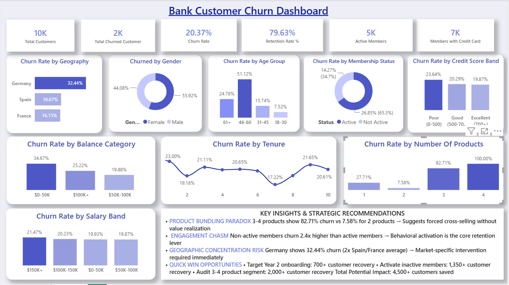

# Bank Customer Churn Analysis & Dashboard

## Business Objective

Identify key customer churn drivers and behavioral patterns to develop targeted retention strategies, enabling the bank to reduce customer attrition and optimize retention spending across high-risk segments.

---

## 📊 Dashboard Preview

### Bank Customer Churn Dashboard

---

## 🛠️ Tools Used

- **Python (Pandas, NumPy)** — data cleaning and feature engineering
- **Jupyter Notebook** — exploratory data analysis
- **Power BI** — dashboard design and visualization
- **DAX** — calculated metrics and KPI development

---

## 🧹 Data Cleaning Process

✅ Verified missing data — only 3 missing surnames (0.03%)  
✅ Removed duplicate records  
✅ Assigned correct data types (int64, float64, object)  
✅ Validated categorical values (Geography, Gender)  
✅ Confirmed no invalid dates or negative values  
✅ Created segmentation columns (AgeGroup, CreditScoreBand, TenureGroup, BalanceCategory)

---

## 📐 Calculated Metrics

| Metric | Description | Formula |
|---|---|---|
| **Churn Rate %** | Percentage of customers who exited | (Churned / Total Customers) × 100 |
| **Retention Rate %** | Percentage of customers retained | (1 - Churn Rate) × 100 |
| **Active Members** | Customers with active membership status | SUM(IsActiveMember = 1) |
| **Cost Per Product** | Customer acquisition by product count | Churned Count / Product Segment |

---

## ❓ Analytical Questions

- Which customer segments have the highest churn risk?
- What is the relationship between product portfolio size and retention?
- How does membership engagement impact customer retention?
- Which geographic markets require immediate intervention?
- What behavioral patterns predict customer exit likelihood?
- How do age groups and credit profiles correlate with churn?
- Which lifecycle stages show vulnerability?

---

## 💡 Key Insights

### 🔴 Product Bundling Paradox

**Customers with 3-4 products show 82.71% churn vs 7.58% for 2-product users** — an 11x differential. This counterintuitive finding suggests forced cross-selling without value realization. Rather than increasing loyalty, product proliferation indicates over-banking or misaligned bundling strategies, generating friction instead of stickiness.

### ⚠️ Engagement Chasm

**Non-active members churn at 34.7% vs 14.27% for active members** — a 2.4x differential and the single largest behavioral predictor. Simply having a product is insufficient; behavioral activation in the first 90 days is the retention foundation. This gap signals a systemic engagement failure in onboarding.

### 📍 Geographic Concentration Risk

**Germany shows 32.44% churn (2x Spain/France at 16.15-16.67%)** — representing geographic vulnerability. This isn't random variance but signals market-specific issues: regulatory friction, competitive pressure, or service delivery gaps. Germany alone accounts for disproportionate revenue leakage.

### 👤 Lifecycle Vulnerability Windows

**Year 2 peaks at 23% churn; Year 10 resurges to 21.65%** — revealing two distinct failure points. Year 2 represents an onboarding/value-delivery gap while Year 10 signals relationship fatigue or competitive erosion. These windows require targeted intervention, not blanket campaigns.

### 💰 Balance Category Insights

**High-balance customers ($0-50K) show 34.67% churn**, surprisingly higher than those with $50K-100K (25.22%) or $100K+ (19.88%). This suggests relationship quality—not account size—drives retention. Affluent customers likely optimize their financial portfolio across institutions.

### 👥 Demographic Signals (Secondary)

**Age 46-60 shows 51.12% churn** (peak risk), while gender and credit score show moderate differentials. Demographics are secondary to behavioral factors; avoid demographic-only segmentation.

---

## 🎯 Recommendations

### 1. Product Strategy Overhaul

**Issue:** 3-4 product customers churn at 82.71%

Audit product bundling immediately. Implement modular architecture allowing customer choice rather than forced bundles. Shift from aggressive cross-selling to value-aligned product recommendations.

**Target:** Reduce 3+ product churn from 82.71% → <40%  
**Impact:** +2,000 customer retention

---

### 2. Engagement-First Operating Model

**Issue:** 5,000 inactive members represent core churn cohort

Implement 30-60-90 day engagement checkpoints post-onboarding. Deploy product education programs and success metrics to drive behavioral activation within critical first 90 days.

**Target:** Activate 30% of inactive members  
**Impact:** +1,350 customer retention

---

### 3. Germany Market Intervention

**Issue:** 32.44% churn (2x other markets)

Conduct market-specific research to identify regulatory, competitive, or service delivery gaps. Pilot localized retention program before scaling across region.

**Target:** Reduce Germany churn by 20%  
**Impact:** +500 customer retention

---

### 4. Lifecycle Campaign Architecture

**Issue:** Year 2 (23%) and Year 10 (21.65%) failure points

Design Year 2 "Value Realization" program (usage analytics, success stories, ROI education). Deploy Year 10 "Loyalty Upgrade" program (rate reductions, exclusive benefits, relationship reviews).

**Target:** Reduce Year 2 & 10 churn by 30%  
**Impact:** +700 customer retention

---

### 5. Shift to Behavioral Segmentation

**Issue:** Demographics explain only 11-15% churn variance

De-prioritize gender/age; prioritize engagement level, product fit, lifecycle stage, and financial behavior. Build predictive churn model using engagement × product mix × tenure patterns.

**Target:** Improve targeting precision by 40%  
**Impact:** Higher campaign ROI; more efficient retention spending

---

### 6. High-Value Customer Strategy

**Issue:** Excellent credit customers still show 19.87% churn

Create VIP tier with quarterly relationship reviews and white-glove service. Implement proactive retention for customers with access to competitive alternatives.

**Target:** 3-5% churn reduction in high-value segment  
**Impact:** +150-250 customer retention

---

## 📁 Files in This Repository

| File | Description |
|---|---|
| `data/bank_churn_raw.csv` | Original dataset (10,000 customers) |
| `data/bank_churn_processed.xlsx` | Cleaned data with segmentation columns |
| `notebooks/01_data_cleaning_eda.ipynb` | Python notebook: data cleaning & analysis |
| `dashboard/Bank_Churn_Dashboard.pbix` | Power BI dashboard with KPIs and segmentation |
| `README.md` | Project documentation |
